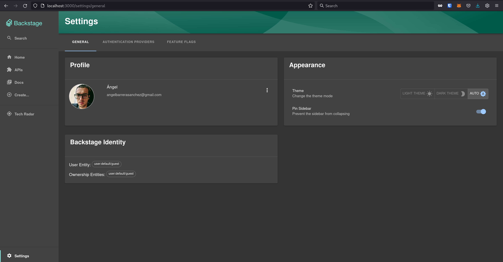
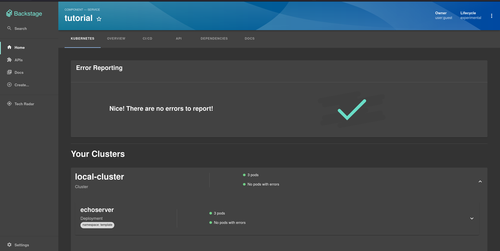

# Backstage

## Enterprise context

In terms of enterprise context, usually, there are no service/app catalog. This means that teams doesn't know what services are available, and they don't know what services are already in use.

One side effect of this is that teams will end up building the same services, and this leads to a lot of duplication of effort.
In addition, some teams could potentially build services that depend on other services, this dependency could be unknown to the teams, and this could lead to a lot of potential problems.

There are companies providing project templates, but they are not really used by the teams, because after a while, the teams will end up changing the templates to fit their needs.

Talking about documentation, you will find a lot of documentation in the form of markdown files, and you will find a lot of documentation in the form of wiki pages, but you will not find a lot of documentation in the form of a single source of truth.

Documentation is not only about the services, but also about the processes, and the tools used by the teams. This is important, because it will help new members to onboard faster.

## What to address?

An IDP frontend like backstage should address the following topics:

- Service/app catalog:
    - Documentation
    - Lifecycle
    - Dependencies
    - Ownership
    - Status
    - Health
    - Metrics
    - Logs
    - Alerts
    - Onboarding
    - Offboarding
    - Cost/billing
    - Security
- Audit:
    - Who is using what
    - Who is using what for how long
    - Who is using what for how much

And more...

## Goal

- Reduce duplication of effort *(by providing a service/app catalog)*
- Reduce wasted time on setup and maintenance *(by providing a service/app template)*
- Reduce the number of tools and processes *(by providing a single source of truth)*
- Easy to onboard new teams *(by providing a service/app template)*
- Easy to update the tooling used by the teams *(by providing a service/app template)*
- Reduce the cognitive load on the teams *(by providing a service/app template and catalog)*

### Enterprise constraints

You may find some of the following constraints in your enterprise context:

- Internal budget
  - Implementing a new tool could be expensive
- Internal politics
  - Silos
- Internal resources
  - You may not have enough internal resources to develop a new tool
  - Usually, platform teams doesn't have frontend developers
- Culture:
  - People may not be willing to use a new tool
- 2022-2023:
  - Economic crisis

## Tech approach

Backstage is the foundation of an IDP. It's a frontend that will provide a service/app catalog, and it will provide a single source of truth for the teams.

### Backstage

Backstage is a frontend that will provide a service/app catalog, and it will provide a single source of truth for the teams.
It can integrate with a lot of tools, and it can provide a lot of features.

- Source code repository
- CI/CD
- Artifact repository
- Service health
- Service metrics
- Service logs
- Service alerts
- Cost/billing

And this features can be extended/implemented with plugins.
Fortunately, community members are already working on a lot of plugins. Also, the plugins can be developed by the enterprise, in the end, it's just a react project. This is a nice feature, because it will allow the enterprise to customize the frontend to fit their needs.

## Company approach

The company must invest on integrating, implementing and maintaining the backstage frontend.
This is a good approach, because it will allow the enterprise to customize the frontend to fit their needs. Furthermore, it could be used as the foundation of an IDP being developed by the enterprise as an internal product (instead of a service or a project).

Having a single source of truth is a good thing, but it's not enough, because the teams will still need to interact with the cluster directly, and they will still need to interact with the tools directly. (this is something other tools like acorn/dagger can address)

## Quick benefits

Centralization of the service/app catalog, and centralization of the single source of truth.

- Documentation
- service/app catalog
- service/app template
- service/app lifecycle
- service/app dependencies
- service/app ownership
- service/app status
- service/app health
- service/app metrics
- service/app logs
- service/app alerts
- service/app onboarding
- service/app offboarding
- service/app cost/billing

## Risks

- The backstage frontend will be a single point of failure
- The backstage frontend will be a single point of attack
- The backstage frontend will be a single point of maintenance (not really a risk, but it's something to consider)
- Company politics
- Company culture
- Fronted developers integrated with the platform team
- Product ownership
    - Product management/development
    - Product roadmap
    - Product vision
    - Product strategy
    - Product marketing
- Backstage internal fork (this is a risk, because it will make it harder to upgrade the backstage frontend)

## References

- https://backstage.io/docs/getting-started/
- https://backstage.io/docs/getting-started/configuration
- https://backstage.io/docs/features/kubernetes/overview
- https://backstage.io/docs/features/techdocs/techdocs-overview
- https://backstage.io/docs/integrations/github/locations

## Extra

- https://backstage.io/docs/architecture-decisions/adrs-overview
- https://www.youtube.com/watch?v=jTqwe57ObFo

### Screenshots

